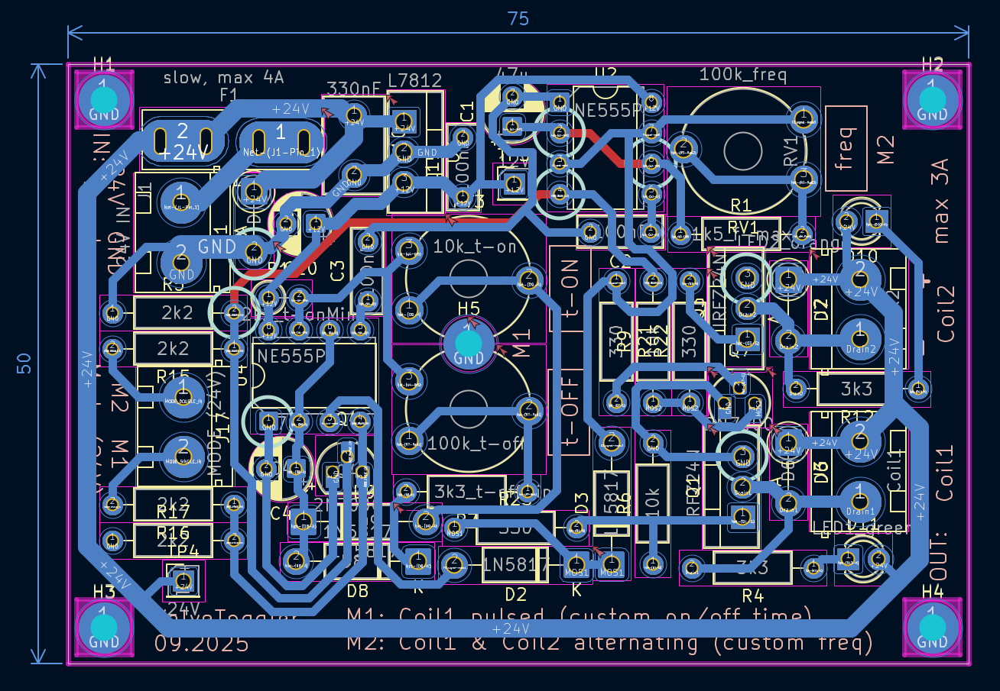

# ValveToggler-24V (Pneumatic Dust Filter Shaker)
Small analog controller PCB that drives a **5/3 pneumatic valve (2 coils)** to shake dust filters of a wood-chip extraction system (*Holzspäne-Absaugung*).  

*Motivation:* Take switching stress off a LOGO! PLC's **relay outputs** (high-frequency, inductive load, continous use over years) by moving the coil drive to **MOSFETs** and hardware timers. The PLC now only provides **high-impedance continous signals** to enable/disable the shaking in the desired mode.

---

## System Hardware
- **24 V DC** supply (same rail as valve coils)
- **5/3-way pneumatic valve** with two **24 V** coils
- **Double acting pneumatic cylinder** shaking the filters
- **Mechanical stops** at cylinders limits for abrupt stop so the dust falls off
- Two PLC control lines: `MODE_SINGLE_24V`, `MODE_DOUBLE_24V` (double has priority)

## PCB Features
- Steps **24 V** mode lines to **12 V**, generates timing with 2x **NE555**
- **Modes & timing**  
  - **SINGLE:** Toggle Coil1 only, with independent **ON/OFF** time (typ. ~300 ms ON, ~1.0 s OFF)  
     Adjustable range ≈ **70 – 400 ms** / **0.1 – 3 s**
  - **DOUBLE:** **50 % duty**, **complementary** coil drive (COIL1 = ¬COIL2)  
     Half-period adjustable from **50 ms to 3 s**
- **Low-side N-MOSFET** drivers, flyback/TVS, indicator LEDs
- Input priority & interlock to prevent both coils ON

---

## Files
- **[Schematic (PDF)](export/ValveToggler_schematic.pdf)**
- **[Layout (PNG)](export/ValveToggler_layout.jpg)**

## Schematic + layout preview:  

  
  

## Photos

  
    

